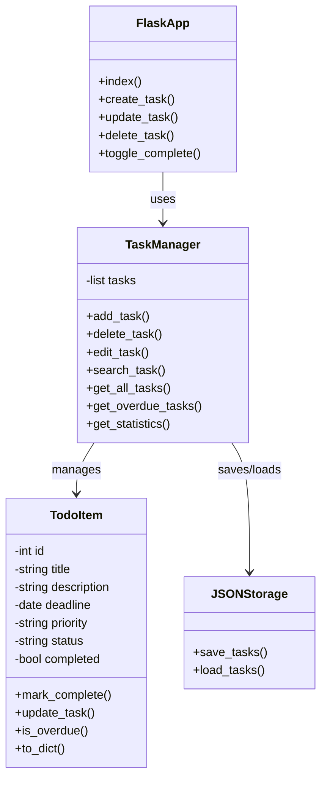
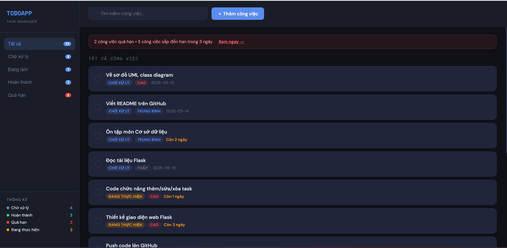
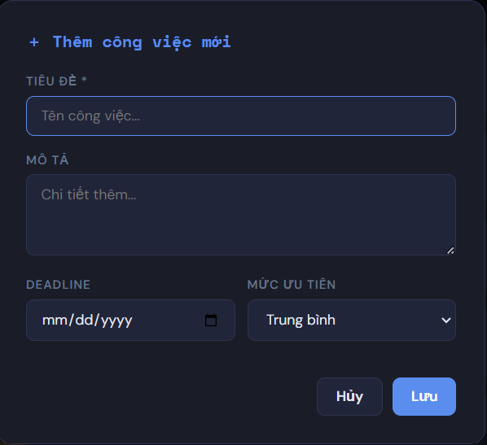
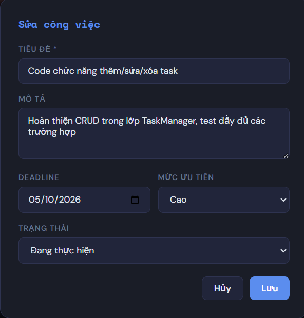

# Báo cáo dự án

---

# 1. Giới thiệu bài toán

Trong quá trình học tập và làm việc, việc quản lý công việc cá nhân là nhu cầu rất cần thiết. 
Nhiều người gặp khó khăn trong việc theo dõi deadline, trạng thái công việc và mức độ ưu tiên.

Dự án TODOAPP được xây dựng nhằm hỗ trợ:

- Quản lý công việc cá nhân
- Theo dõi deadline
- Phân loại trạng thái task
- Tăng hiệu quả học tập và làm việc

Ứng dụng được phát triển bằng Python Flask với giao diện web hiện đại và dễ sử dụng.

---

# 2. Phân tích yêu cầu

## Yêu cầu chức năng

Hệ thống cần hỗ trợ:

- Thêm công việc mới
- Chỉnh sửa công việc
- Xóa công việc
- Đánh dấu hoàn thành
- Theo dõi task quá hạn
- Tìm kiếm công việc
- Thống kê số lượng task

---

## Yêu cầu giao diện

- Giao diện trực quan
- Dark mode hiện đại
- Hiển thị trạng thái rõ ràng
- Responsive layout

---

## Yêu cầu kỹ thuật

- Sử dụng Python Flask
- Lưu dữ liệu bằng JSON
- Thiết kế theo hướng đối tượng (OOP)
- Quản lý source code bằng GitHub

---

# 3. Thiết kế chương trình

## UML Class Diagram

# UML Class Diagram

---

## Các class chính

### TodoItem

Dùng để quản lý thông tin của từng công việc.

#### Thuộc tính

- title
- description
- deadline
- priority
- status
- completed

#### Chức năng

- Kiểm tra quá hạn
- Đánh dấu hoàn thành
- Chuyển đổi dữ liệu sang dictionary

---

### TodoApp

Dùng để quản lý danh sách công việc.

#### Chức năng

- Thêm task
- Xóa task
- Chỉnh sửa task
- Tìm kiếm task
- Lưu dữ liệu JSON
- Đọc dữ liệu JSON

---

# 4. Mô tả các chức năng

## Trang chính

Hiển thị:

- Danh sách công việc
- Bộ lọc trạng thái
- Thống kê task
- Task quá hạn

---

## Chức năng thêm task

Cho phép người dùng:

- Nhập tiêu đề
- Mô tả công việc
- Deadline
- Mức ưu tiên

---

## Chức năng chỉnh sửa task

Cho phép cập nhật:

- Nội dung task
- Trạng thái
- Deadline
- Priority

---

## Chức năng quản lý trạng thái

Hệ thống hỗ trợ:

- Chờ xử lý
- Đang thực hiện
- Hoàn thành
- Quá hạn

---

## Chức năng tìm kiếm

Cho phép tìm kiếm nhanh công việc theo tên.

---

# 5. Demo kết quả

## Kết quả đạt được

Ứng dụng đã hoàn thành:

- Giao diện web hoàn chỉnh
- CRUD task
- REST API Flask
- Quản lý dữ liệu JSON
- Thống kê công việc
- Cảnh báo task quá hạn

---

## Demo các chức năng

### Demo thêm task

Người dùng có thể thêm công việc mới.

### Demo toggle complete

Đánh dấu công việc hoàn thành.

### Demo task quá hạn

Hệ thống tự động cảnh báo công việc quá deadline.

### Demo delete task

Cho phép xóa task khỏi hệ thống.

---

# 6. Hướng phát triển thêm

Trong tương lai, hệ thống có thể mở rộng thêm:

- Đăng nhập tài khoản
- Database SQLite/MySQL
- Notification reminder
- Calendar view
- Drag & Drop task
- Mobile responsive
- REST API hoàn chỉnh
- Deploy online bằng Render hoặc Railway

---

# Kết luận

TODOAPP là dự án giúp thực hành:

- Python Flask
- OOP
- REST API
- Thiết kế giao diện web
- Git/GitHub workflow

Dự án có thể tiếp tục phát triển thành hệ thống quản lý công việc hoàn chỉnh trong thực tế.