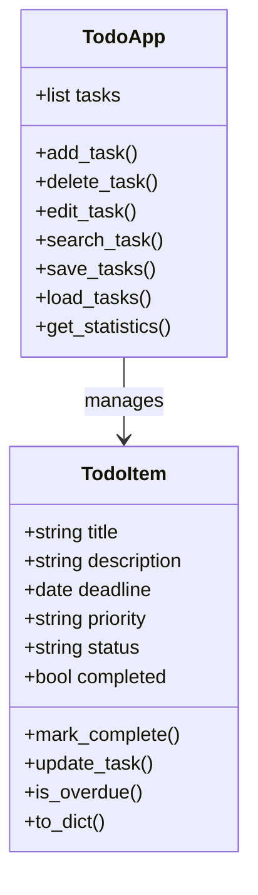

# TO-DO APP

Python Flask To-Do App
# TODOAPP - Flask Task Manager

## Giới thiệu

TODOAPP là ứng dụng quản lý công việc được xây dựng bằng Python Flask với giao diện web hiện đại theo phong cách dark mode. Ứng dụng hỗ trợ người dùng tạo, chỉnh sửa, theo dõi và quản lý tiến độ công việc hằng ngày.

Dự án tập trung vào:

* Xây dựng REST API bằng Flask
* Thiết kế giao diện web trực quan
* Quản lý dữ liệu task bằng JSON
* Thực hành OOP với Python
* Áp dụng mô hình quản lý task thực tế

---

# Tính năng chính

## Quản lý công việc

* Thêm công việc mới
* Chỉnh sửa công việc
* Xóa công việc
* Đánh dấu hoàn thành
* Thay đổi trạng thái task

## Theo dõi tiến độ

* Hiển thị task quá hạn
* Hiển thị task sắp đến hạn
* Phân loại theo trạng thái
* Thống kê số lượng công việc

## Tìm kiếm & giao diện

* Tìm kiếm công việc nhanh
* Giao diện dark mode hiện đại
* Responsive layout
* Badge màu cho priority/status

---

# Công nghệ sử dụng

| Công nghệ    | Mục đích                 |
| ------------ | ------------------------ |
| Python       | Ngôn ngữ lập trình chính |
| Flask        | Backend framework        |
| HTML/CSS     | Xây dựng giao diện       |
| JavaScript   | Xử lý tương tác frontend |
| JSON         | Lưu trữ dữ liệu task     |
| Git & GitHub | Quản lý source code      |

---

# Cấu trúc project

```bash
TODOAPP/
│
├── templates/           # Giao diện HTML
├── app.py               # Flask backend + REST API
├── todo_app.py          # Business logic
├── seed_data.py         # Dữ liệu mẫu
├── tasks.json           # Lưu danh sách task
├── README.md
├── LICENSE
└── .gitignore
```

---

# Hướng dẫn chạy project

## 1. Clone repository

```bash
git clone <repository-url>
cd TODOAPP
```

## 2. Tạo môi trường ảo

```bash
python -m venv venv
```

### Windows

```bash
venv\Scripts\activate
```

### Linux / macOS

```bash
source venv/bin/activate
```

---

## 3. Cài thư viện

```bash
pip install flask
```

---

## 4. Chạy ứng dụng

```bash
python app.py
```

Mở trình duyệt:

```bash
http://127.0.0.1:5000
```

---

# UML Class Diagram

## Class: TodoItem

### Thuộc tính

* title
* description
* deadline
* priority
* status
* completed

### Phương thức

* mark_complete()
* update_task()
* is_overdue()
* to_dict()

---

## Class: TodoApp

### Thuộc tính

* tasks

### Phương thức

* add_task()
* delete_task()
* edit_task()
* search_task()
* save_tasks()
* load_tasks()
* get_statistics()

---

## UML (Mermaid)



---

# Hướng dẫn vẽ UML bằng Draw.io

## Bước 1

Mở:

[https://app.diagrams.net/](https://app.diagrams.net/)

## Bước 2

Chọn:

* Create New Diagram
* Blank Diagram

## Bước 3

Tạo 2 class:

* TodoItem
* TodoApp

## Bước 4

Thêm:

* Attributes
* Methods
* Quan hệ association giữa TodoApp và TodoItem

## Bước 5

Export:

* PNG
* PDF
* SVG

---

# Demo hệ thống

## Màn hình chính

* Danh sách công việc
* Bộ lọc trạng thái
* Thống kê task
* Cảnh báo quá hạn

## Chức năng demo khi thuyết trình

### 1. Thêm task

Demo form thêm công việc mới.

### 2. Task quá hạn

Cho thấy hệ thống tự động cảnh báo công việc quá deadline.

### 3. Toggle complete

Đánh dấu công việc hoàn thành.

### 4. Delete task

Xóa task khỏi hệ thống.

### 5. Search task

Tìm kiếm nhanh công việc.

---

# Kiến trúc Flask

```text
Frontend (HTML/CSS/JS)
        ↓
Flask Routes / REST API
        ↓
Business Logic (TodoApp)
        ↓
JSON Storage (tasks.json)
```

---

# Git Commits nổi bật

Ví dụ commit:

```bash
feat: Xay dung Flask backend va REST API
feat: Hoan thien giao dien web va README
feat: Dinh nghia class Task, Priority, Status
```

Commit rõ ràng giúp:

* Theo dõi tiến độ
* Quản lý phiên bản
* Chuyên nghiệp hơn khi nộp project

---

# Hướng phát triển

## Có thể mở rộng thêm

* Đăng nhập tài khoản
* Database SQLite/MySQL
* Upload file
* Reminder notification
* Calendar view
* Drag & Drop task
* Responsive mobile app
* REST API hoàn chỉnh

---

# Kịch bản thuyết trình PPT

## Slide 1 — Giới thiệu

* Tên đề tài
* Thành viên
* Mục tiêu project

---

## Slide 2 — Yêu cầu bài toán

* Quản lý task cá nhân
* Theo dõi deadline
* Quản lý trạng thái công việc
* Giao diện dễ sử dụng

---

## Slide 3 — UML

* Class TodoItem
* Class TodoApp
* Quan hệ giữa các class

---

## Slide 4 — Kiến trúc Flask

* Frontend
* Flask Backend
* JSON Storage
* REST API

---

## Slide 5 — Demo Web

Hiển thị:

* Dashboard
* Add task
* Edit task
* Delete task
* Overdue warning

---

## Slide 6 — Git Commits

Trình bày:

* Quá trình phát triển project
* Các commit chính
* GitHub repository

---

## Slide 7 — Hướng phát triển

* Database
* Authentication
* Notification
* Mobile support

---

## Slide 8 — Q&A

```text
THANK YOU
Questions?
```

---

# Mẹo lấy điểm khi demo

## Nên demo theo thứ tự

1. Thêm task mới
2. Sửa task
3. Toggle hoàn thành
4. Hiển thị task quá hạn
5. Tìm kiếm task
6. Xóa task
7. Show Git commits

---

# Kết luận

TODOAPP là dự án phù hợp để thực hành:

* Flask backend
* OOP Python
* REST API
* Thiết kế giao diện web
* Git/GitHub workflow

Dự án có thể tiếp tục mở rộng thành ứng dụng quản lý công việc hoàn chỉnh trong thực tế.
